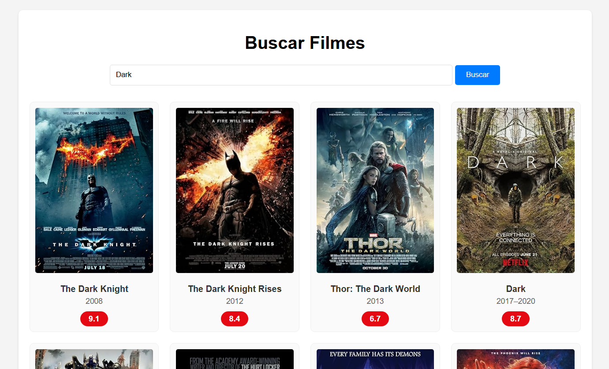
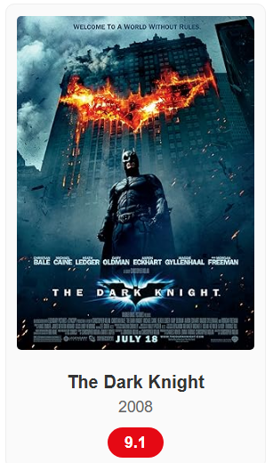

# 🎬 Busca de Filmes OMDB (Java Web)

Aplicação web desenvolvida em Java para consultar e listar filmes utilizando a API pública da OMDB. O projeto foca em boas práticas de segurança (ocultação da API Key no backend) e consumo de APIs REST com carregamento assíncrono de dados.

---

## 📸 Demonstração

### 1. Tela Inicial
Interface limpa e responsiva aguardando a interação do usuário.


### 2. Resultado da Busca (Lista)
Exibição dos filmes encontrados em formato de grid.


### 3. Detalhes e Notas
As notas (IMDb) são carregadas individualmente para garantir precisão.



---

## 🚀 Funcionalidades

* **Busca por Título:** Permite pesquisar filmes por nome (ex: "Batman", "Matrix").
* **Listagem em Grid:** Exibe múltiplos resultados correspondentes à pesquisa, não apenas o primeiro.
* **Carregamento Assíncrono de Notas:** Realiza uma segunda chamada automática para buscar a nota exata (IMDb Rating) de cada filme listado.
* **Segurança de Credenciais:** A API Key da OMDB é armazenada no servidor e nunca é exposta no código-fonte do frontend (navegador).
* **Interface Responsiva:** Layout adaptável com CSS Grid.

---

## 🛠️ Tecnologias Utilizadas

* **Linguagem:** Java 11
* **Backend:** Java Servlet API (javax.servlet)
* **Cliente HTTP:** Apache HttpComponents (HttpClient)
* **Gerenciador de Dependências:** Apache Maven
* **Servidor:** Apache Tomcat 9
* **Frontend:** HTML5, CSS3, JavaScript (Fetch API)

---

## 🏗️ Arquitetura e Fluxo de Dados

O projeto segue o padrão MVC (Model-View-Controller) simplificado:

1.  **Frontend (`index.html`):**
    * Envia o título digitado para o Servlet.
    * Recebe a lista de filmes.
    * Faz novas requisições automáticas (por ID) para preencher as notas de cada card.
2.  **Controller (`FilmeServlet`):**
    * Gerencia as rotas `/buscar-filme`.
    * Decide se deve buscar uma **lista** (pelo título) ou **detalhes** (pelo ID).
3.  **Service (`OmdbService`):**
    * Carrega a chave de API de forma segura.
    * Executa as chamadas HTTPS para a `omdbapi.com`.
4.  **Configuração (`Configuracao`):**
    * Lê o arquivo `config.properties` do classpath.

---

## ⚙️ Configuração e Instalação

### Pré-requisitos
* Java JDK 11+
* Eclipse IDE (Enterprise Java and Web Developers)
* Apache Tomcat 9
* Chave de API da OMDB (Obtenha gratuitamente em [omdbapi.com](https://www.omdbapi.com/apikey.aspx))

### Passo a Passo

1.  **Clonar o Repositório**
    ```bash
    git clone https://github.com/LucasJSM/movies-api.git
    ```

2.  **Configurar a API Key (Segurança)**
    * Vá até a pasta `src/main/resources`.
    * Crie um arquivo chamado `config.properties`.
    * Adicione sua chave no seguinte formato:
        ```properties
        omdb.api.key=SUA_CHAVE_AQUI
        ```
    * *Nota: Este arquivo é ignorado pelo Git para proteger sua chave.*

3.  **Importar no Eclipse**
    * `File` > `Import` > `Existing Maven Projects`.

4.  **Executar**
    * Clique com botão direito no projeto > `Run As` > `Run on Server`.
    * Acesse: `http://localhost:8080/omdb-consulta-filmes/`

---

## 📂 Estrutura de Pastas

```text
omdb-consulta-filmes/
├── src/
│   ├── main/
│   │   ├── java/br/com/omdb/
│   │   │   ├── controller/  # FilmeServlet.java
│   │   │   ├── service/     # OmdbService.java
│   │   │   └── util/        # Configuracao.java
│   │   ├── resources/       # config.properties (Criar este arquivo e inserir a api key)
│   │   └── webapp/          # index.html, CSS e JS
└── pom.xml                  # Dependências Maven